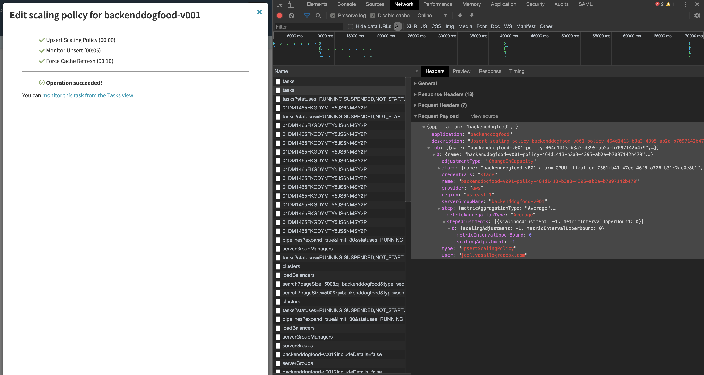

.. _advanced_custom_scaling_policies

################################################
``custom_scaling_policies`` - V2 Cluster Scaling
################################################

.. warning:: This is for advanced usage and expects understanding of how Spinnaker's API works.

Enables the ability to define custom Spinnaker Cluster Scaling Policies,
as defined by the Spinnaker API. This enables support for multiple scaling 
policies as well as custom metrics using Provider metrics. Currently, only
tested with AWS AutoScaling groups.

There are no defaults set, however, we do have a helper method to lookup the latest 
``AutoScalingGroupName`` if the dimension metric value is set to ``"$self"``. This is mainly
due to the fact the cluster name in Spinnaker is not known until deployment. In addition, all the 
templates are completely configurable if needed. Refer to the documentation section on using 
`Custom Pipelines <https://foremast.readthedocs.io/en/latest/pipeline_examples.html#custom-pipelines>`_  
on using a custom ``templates_path``.

.. contents::
   :local:

*Building/Creating* ``custom_scaling_policies``
***********************************************

Custom values found below in our short examples and keys can be rather complex. For this reason, we recommend
creating the scaling policies needed via the Spinnaker UI first and watching a browser network tab for the ``POST``
request body to the Spinnaker Gate ``"/tasks"`` API. This will contain the payload needed to get the values for 
the below usage example.

``custom_scaling_policies`` *Examples*
**************************************

This section contains example usage but you are encouraged to modify and build your own scaling
configurations that meet your needs. Keys such as ``"namespace"`` and ``"metric_name"`` must be metrics
from your provider and Spinnaker must have access to those metrics as well. The most common is AWS Cloudwatch Metrics.
These values are hyper-specific to each end-user so not all keys will be defined in this document.

.. note::  To facilitate finding the name of cluster names generated by Spinnaker, users can specify a dimensions 
           referencing ``"$self"`` to let Foremast find the custom name

.. code-block:: json

   {
      "dimensions": [
         {
               "name": "AutoScalingGroupName",
               "value": "$self"
         }
      ]
   }

``custom_scaling_policies`` *Simple Step Scaling Example*
=========================================================

.. note::  This policy adds 1 instance between 75-85% CPU, 3 instances between 85-95, and 5 instances over 95% after 3 evaluation_periods of 1 minute.

.. code-block:: json

   {
      "custom_scaling_policies": [
         {
            "scaling_type": "step_scaling",
            "instance_warmup": 300,
            "scaling_metric": {
               "metric_name": "CPUUtilization",
               "namespace": "AWS/EC2",
               "comparison_operator": "GreaterThanThreshold",
               "evaluation_periods": 3,
               "evaluation_period": 60,
               "threshold": 75,
               "statistic": "Average",
               "dimensions": [
                  {
                        "name": "AutoScalingGroupName",
                        "value": "$self"
                  }
               ],
               "steps": [
                  {
                     "scalingAdjustment": 1,
                     "metricIntervalUpperBound": 10,
                     "metricIntervalLowerBound": 0
                  },
                  {
                     "scalingAdjustment": 3,
                     "metricIntervalUpperBound": 20,
                     "metricIntervalLowerBound": 10
                  },
                  {
                     "scalingAdjustment": 5,
                     "metricIntervalLowerBound": 20
                  }
               ]
            },
            "disable_scale_in": false
         }
      ]
   }

``custom_scaling_policies`` *Multiple Scaling Policies Example*
===============================================================

.. note::  An important consideration when scaling up, is also scaling down. 
           This policy block scales up a cluster when when ``CPUUtilization`` is ``GreaterThanThreshold`` of 50% by adding 5 servers.
           This policy block also scales down a cluster when ``CPUUtilization`` is ``LessThanThreshold`` of 25% and removes 1 server.

.. code-block:: json

   {
      "custom_scaling_policies": [
         {
            "scaling_type": "step_scaling",
            "instance_warmup": 300,
            "scaling_metric": {
               "metric_name": "CPUUtilization",
               "namespace": "AWS/EC2",
               "comparison_operator": "GreaterThanThreshold",
               "evaluation_periods": 1,
               "evaluation_period": 60,
               "threshold": 50,
               "statistic": "Average",
               "dimensions": [
                  {
                        "name": "AutoScalingGroupName",
                        "value": "$self"
                  }
               ],
               "steps": [
                    {
                        "scalingAdjustment": 5,
                        "metricIntervalLowerBound": 0
                    }
                ]
            },
            "disable_scale_in": false
         },
         {
            "scaling_type": "step_scaling",
            "instance_warmup": 300,
            "scaling_metric": {
               "metric_name": "CPUUtilization",
               "namespace": "AWS/EC2",
               "comparison_operator": "LessThanThreshold",
               "evaluation_periods": 1,
               "evaluation_period": 300,
               "threshold": 25,
               "statistic": "Average",
               "dimensions": [
                  {
                        "name": "AutoScalingGroupName",
                        "value": "$self"
                  }
               ],
               "steps": [
                    {
                        "scalingAdjustment": -1,
                        "metricIntervalUpperBound": 0
                    }
                ]
            },
            "disable_scale_in": false
         }
      ]
   }

``custom_scaling_policies`` *Target Tracking Predefined Metrics Example*
========================================================================

.. note::  | This policy used predefined target tracking metrics to perform target tracking. Refer
           | to the official AWS Documentation (or Spinnaker GUI) for list of predefined metric spec of each service such as:
           |      `EC2 Predefined Metric Spec <https://docs.aws.amazon.com/autoscaling/ec2/APIReference/API_PredefinedMetricSpecification.html>`_  

.. code-block:: json

   {
        "custom_scaling_policies": [
            {
                "scaling_type": "target_tracking",
                "instance_warmup": 180,
                "target_value": 60,
                "scaling_metric": {
                    "metric_type": "predefined",
                    "metric_name": "ASGAverageCPUUtilization"
                },
                "disable_scale_in": false
            }
        ]

``custom_scaling_policies`` *Target Tracking Custom Metrics Example*
====================================================================

.. note::  | This policy used predefined target tracking metrics to perform target tracking. Refer
           | to the official AWS Documentation (or Spinnaker GUI) for list of predefined metric spec of each service such as:
           |    `EC2 Predefined Metric Spec <https://docs.aws.amazon.com/autoscaling/ec2/APIReference/API_PredefinedMetricSpecification.html>`_  

.. code-block:: json

   {
        "custom_scaling_policies": [
            {
                "scaling_type": "target_tracking",
                "instance_warmup": 180,
                "target_value": 60,
                "scaling_metric": {
                    "metric_type": "predefined",
                    "metric_name": "ASGAverageCPUUtilization"
                },
                "disable_scale_in": false
            }
        ]

``custom_scaling_policies`` *Keys*
**********************************

``scaling_type``
================

   Scaling Policy Type to use

      | *Type*: string
      | *Options*:

         - ``"step_scaling"``
         - ``"target_tracking"``

``instance_warmup``
=================== 

   Time period to wait before collecting metrics from cluster

      | *Type*: int
      | *Default*: 300
      | *Units*: seconds

``disable_scale_in``
====================

   You can disable the scale-in portion of a target tracking scaling policy. This feature provides you with the flexibility to 
   scale in your Auto Scaling group using a different method. For example, you can use a different scaling policy type for scale 
   in while using a target tracking scaling policy for scale out.

      | *Policy*: ``"target_tracking"``
      | *Type*: boolean
      | *Default*: ``false``

``scaling_metric`` *Keys*
=========================

``metric_type``
^^^^^^^^^^^^^^^

   .. note::  Only used with ``"scaling_type"`` policies that are of type ``target_tracking``.

   Specify the type of metric to use for evaluation: ``"custom"`` or ``"predefined"``

   If leveraging predefined metrics, ensure the name of the metric is supported via AWS Predefined Metric Spec (or via Spinnaker UI) such as: 
   `EC2 Predefined Metric Spec <https://docs.aws.amazon.com/autoscaling/ec2/APIReference/API_PredefinedMetricSpecification.html>`_  
   
      | *Type*: string
      | *Default*: ``None``
      | *Example Options*:

         -  ``"predefined"``
         -  ``"custom"``

``namespace``
^^^^^^^^^^^^^

   A namespace within a given provider to search metrics within.

      | *Type*: string
      | *Default*: ``None``
      | *Example Options*:

         - ``"AWS/EC2"``
         - ``"AWS/SQS"``

``metric_name``
^^^^^^^^^^^^^^^

   A Metric Name to search a given provider for. If ``metric_type`` is ``"predefined"`` for target tracking, 
   ensure the name of the metric is supported via AWS Predefined Metric Spec API such as 
   `EC2 Predefined Metric Spec <https://docs.aws.amazon.com/autoscaling/ec2/APIReference/API_PredefinedMetricSpecification.html>`_  

      | *Type*: string
      | *Default*: ``None``
      | *Example Options*:

         - ``"CPUUtilization"``
         -  ``"NetworkIn"``
         -  ``"NetworkOut"``
         -  ``"DiskReadBytes"``

``statistic``
^^^^^^^^^^^^^

   Statistic to calculate at the period to determine if threshold was met

      | *Type*: string
      | *Default*: ``None``
      | *Example Options*:

         - ``"Average"``
         - ``"Maximum"``
         - ``"Minimum"``
         - ``"Sum"``

``evaluation_periods``
^^^^^^^^^^^^^^^^^^^^^^

   Count of evaluation periods to evalutate/check metrics (i.e. ``Average`` of 3 ``evaluation_periods`` every 30 second ``evaluation_period``)

      | *Type*: int

``evaluation_period``
^^^^^^^^^^^^^^^^^^^^^

   Time period in between metrics evaluations

      | *Type*: int
      | *Units*: seconds

``threshold``
^^^^^^^^^^^^^

   Metric value threshold to begin scaling activities on. 

      | *Type*: int
      | *Default*: ``None``

``comparison_operator``
^^^^^^^^^^^^^^^^^^^^^^^

   Comparison operator to perform against ``threshold``

      | *Type*: string
      | *Default*: ``None``
      | *Example Options*:

         -  ``"GreaterThanThreshold"``
         -  ``"LessThanThreshold"``

``dimensions``
^^^^^^^^^^^^^^

   Metric limitations such as specific metric values (such as AutoScalingGroupName, SQSQueueName, etc)

   If a dimension name ``"AutoScalingGroupName"`` is provided and the value is equal to ``"$self"`` Foremast will autodefine the current deployment.

      | *Type*: List of Objects
      | *Default*: ``None``
      | *Example Options*:

         .. code-block:: json

            {
               "dimensions": [
                  {
                        "name": "AutoScalingGroupName",
                        "value": "$self"
                  }
               ]
            }

``steps``
^^^^^^^^^

   Steps to perform based on baseline ``threshold``

      | *Type*: List of Objects
      | *Default*: ``None``
      | *Example Options*:

         *Simple Scaling Bound*

         .. note::  Negative scalingAdjustment denote a removal operation.

         .. code-block:: json

            {
               "steps": [
                     {
                        "scalingAdjustment": -1,
                        "metricIntervalUpperBound": 0
                     }
                  ]
            }

         *Complex Upper and Lower Bound Range Step*

         .. note:: | ``metricIntervalUpperBound`` and ``metricIntervalLowerBound`` are compounded on the threshold
                   |
                   | I.E. do a step bound of 60-75% with a base ``"threshold"`` of 50 would have a ``"metricIntervalLowerBound"`` of 0 (50+10=60) and `"metricIntervalUpperBound"` of 20 (50+25=75))

         .. code-block:: json

            {
               "steps": [
                     {
                        "scalingAdjustment": 3,
                        "metricIntervalUpperBound": 25,
                        "metricIntervalLowerBound": 10
                     }
                  ]
            }