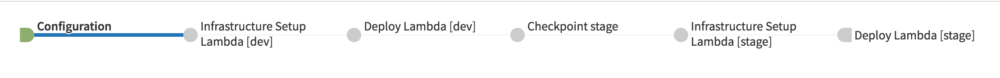

Lambda Pipeline
===============

.. contents::
   :local:

Overview
--------

Foremast supports the ability to setup Lambda infrastucture and build a pipeline around Lambda deployments. This was designed to be very similar to the default EC2 pipeline. It requires the same configuration files and general setup

Lambda Specific Setup
---------------------

  1. Look at the :docs:`getting_started` guide for basic setup. The Lambda process will be very similar
  2. Look at the lambda specific configurations in :doc:`pipeline_json` and :doc:`application_json`. 
  3. In :doc:`pipeline_json` set ``"type" : "lambda"`` in order for Foremast to treat the application as a Lambda function.
  4. Setup the desired Lambda triggers. See :doc:`lambda_events` for details.

Lambda Pipeline Example
-----------------------

  1. Generate a ZIP artifact of your desired Lambda function
  2. Trigger Spinnaker Lambda pipeline
  3. Spinnaker runs "Infrastructure Setup Lambda"

     1. Sets up default function
     2. Sets up event triggers
     3. Sets up IAM Roles
     4. Sets up security groups if ncessary
  4. Spinnaker runs a "Deploy Lambda" stage

     1. This stage uploads the ZIP artifact to the created Lambda function
  5. Manual Judgement checkpoint for deploying to the next environment
  6. Repeat steps 3-5 for each desired environment

