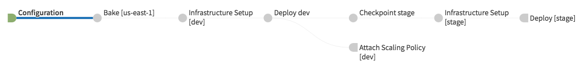

.. _pipeline_examples:

==========================
Pipeline Flow and Examples
==========================

.. contents::
   :local:

Foremast generates a single pipeline per region. The pipeline is designed to
allow deploying to multiple environment with checkpoints between each
transition.

Default Pipeline Flow
---------------------

The below flow can repeat for as many environments as defined in the configs. At
Gogo, most applications go through these stages 3 times as we deploy to dev,
stage, and production.

1. Configuration

   - This stages defines the Jenkins trigger, property files, and pipeline-wide
     notifications

2. Bake

   - Bakes an AMI the specified AMI ID

3. Infrastructure Setup [$env]

   - Calls a Jenkins job to run the ``prepare-infrastructure`` Foremast command
     against a specific account.
   - Setups AWS infrastructure such as ELB, IAM roles, S3 bucket, and DNS needed
     for an application

4. Deploy $env

   - Uses Spinnaker to create a cluster and server group in specific account.
   - The behavior of this stage is largely based on the :ref:`application_json`
     configs.

5. Attach Scaling Policy [$env]

   - If a scaling policy is defined in :ref:`application_json`, attaches it to
     the deployed server group
   - If no policy is defined, this stage is excluded

6. Checkpoint $next-env

   - A manual checkpoint stage. This requires human intervention to approve
     deployment to the next environment.

Stages 3-6 repeat for each environment/account defined in :ref:`pipeline_json`.

The default generated pipeline should look like the above image. This is the
basic `bake` -> `infrastructure` -> `deploy` -> `checkpoint` pipeline described
above.

Custom Pipelines
----------------

You can specify an external templates directory in :ref:`foremast_config`.
Templates in an external directory will need to have the same directory
structure and naming as the default templates. if `templates_path` is set in
:ref:`foremast_config`, Foremast will first see if the file exists there. If
not, it will fall back to the provided templates.

If you need to add more stages or  change the defaults, this is all possible via
external templates. Please the `foremast-templates repo`_ for examples on the
templates.

Example Workflow
-----------------

At Gogo we have a detailed workflow for using Foremast internally. Feel free to
copy our workflow or use it as inspiration for your own. You can view all of our
internal templates on the `foremast-templates repo`_.

.. image:: _static/gogo-pipeline.png

#. The :ref:`application_json` and :ref:`pipeline_json` are bundled directly
   with the application code

#. Developer makes a change to one of those configs and pushes to the
   application's git repository

#. A server-side git hook detects a change and triggers a Jenkins job to run
   Foremast ``prepare-app-pipeline``

   - Regenerates the application and pipeline in Spinnaker

#. Build application artifacts using a Jenkins job and stored as an RPM

#. Spinnaker triggers detect a completed Jenkins job and starts a new deployment
   pipeline

   #. Bake an AMI using built RPM
   #. Jenkins Stage runs Foremast ``prepare-infrastructure``

      - Creates the AWS ELB, SG, S3 bucket, and IAM roles

   #. Jenkins Stage tags the source repository with AMI info
   #. Deploy the generated AMI to desired environments
   #. Jenkins Stage runs Quality Engineering tests against deployed application
   #. Jenkins Stage tags the source repository with deployment information
   #. Jenkins Stage attaches defined scaling policies
   #. Manual judgment before continuing to the next environment

.. _`foremast-templates repo`: https://github.com/foremast/foremast-template-examples
