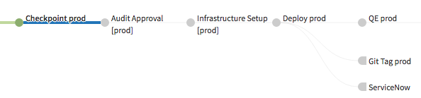

==========================
Pipeline Flow and Examples
==========================

.. contents::
   :local:

Foremast generates a single pipeline per region. The pipeline is designed to allow deploying to multiple environment with checkpoints between each transition. At this time, the generated pipeline is not very customizable with out changing the source templates. We would like to include custom templates in a future release.

Pipeline Flow
-------------

The below flow can repeat for as many environments as defined in the configs. At Gogo, most applications go through these stages 3 times as we deploy to dev, stage, and production.

1. Configuration

  - This stages defines the Jenkins trigger, property files, and pipeline-wide notifications

2. Bake

  - Bakes an AMI the specified AMI ID

3a. Infrastructure Setup [$env]

  - Calls a Jenkins job to run the ``prepare-infrastructure`` Foremast command against a specific account.
  - Setups AWS infrastructure such as ELB, IAM roles, S3 bucket, and DNS needed for an application

3b. Git Tag packaging

  - Runs a Jenkins job to tag the repository

4. Deploy $env

   - Uses Spinnaker to create a cluster and server group in specific account.
   - The behavior of this stage is largely based on the :doc:`application_json` configs.

5a. QE $env

  - Runs a Jenkins job for for QE/QA checks

5b. Git Tag $env

  - Runs a Jenkins job for tagging the repository

5c. Attach Scaling Policy [$env]

  - If a scaling policy is defined in :doc:`application_json`, attaches it to the deployed server group
  - If no policy is defined, this stage is excluded

6. Checkpoint $env

   a) A manual checkpoint stage. This requires human intervention to approve deployment to the next environment.

Prod Pipeline Extras
********************

If the desired environment starts with "prod", there are a few extra stages that get added.

1. Audit Approval [$env]

   - Triggers a jenkins job that checks if the Checkpoint approver is the same person that made the most recent commit. If true the pipeline fails. This makes it so that at least two people need to be involved in any change. 

2. ServiceNow

   - This is a stage for creating a ServiceNow ticket for new deployments. 

Stages 3a-6 repeat for each environment/account defined in :doc:`pipeline_json`.

Pipeline Examples
-----------------
.. image:: _static/single-env-pipeline.png

An example of a single environment non-prod deployment pipeline. 

An example of the production stages of a pipeline.

